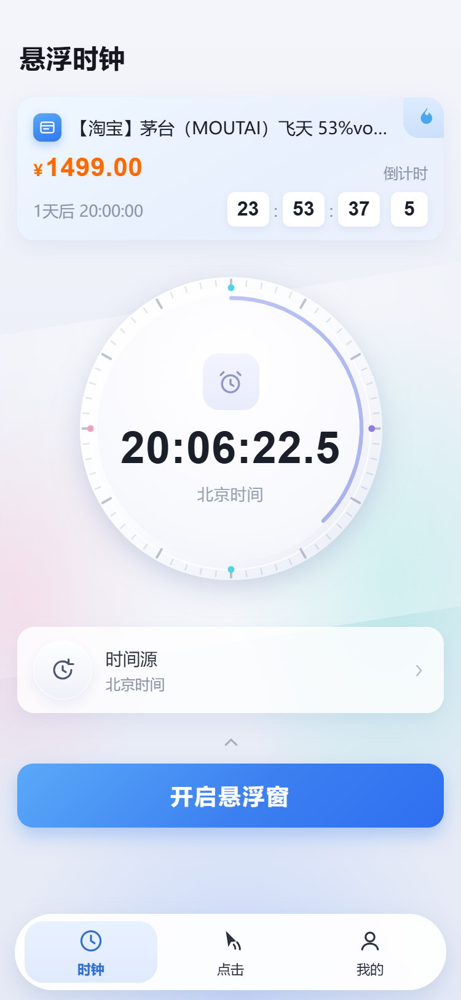
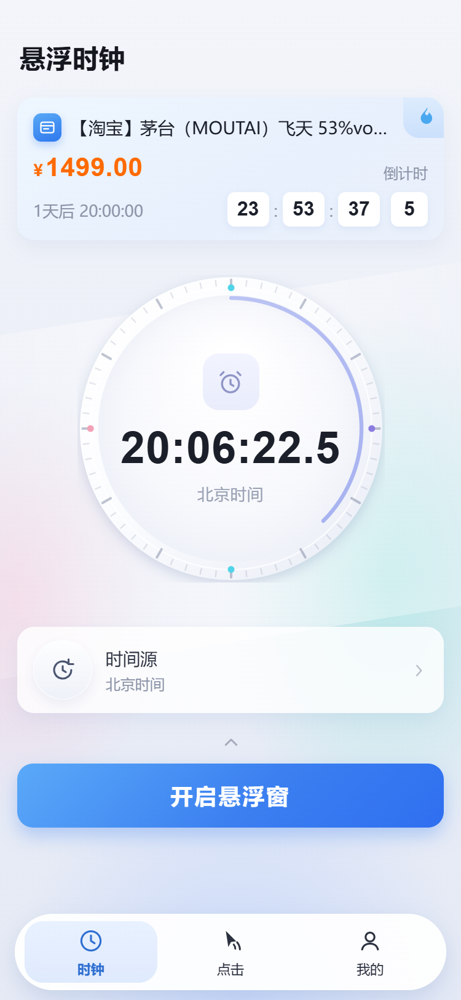
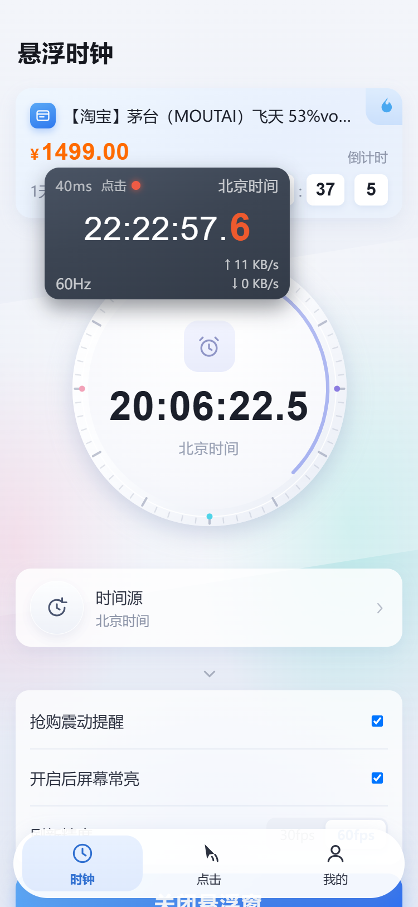
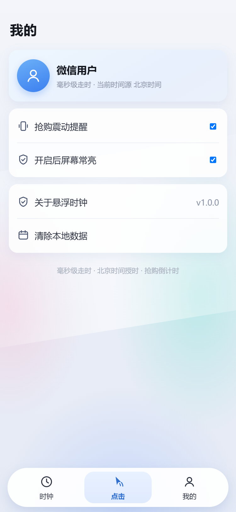

# 悬浮时钟 · 微信小程序

按参考图还原的「悬浮时钟 / 抢购倒计时」小程序，可直接用微信开发者工具打开运行。

## 一、快速开始

1. 打开「微信开发者工具」→ 导入项目 → 目录选择本文件夹。
2. AppID 已填 `wx204a54ab304970bd`（`project.config.json` 的 `appid` 字段，要换号改这一行）。
3. 编译运行，默认进入 `pages/clock/clock`。

> 无任何二进制资源：全部图标由 `utils/icons.js` 用代码生成 SVG 并转成 base64 data URI。

## 二、功能范围

**保留**

| 模块 | 说明 |
| --- | --- |
| 环形时钟 | **DOM + SVG**（不用 canvas）：盘面/渐变/投影是 DOM，60 格刻度与四色定位点是一张静态 SVG，进度弧按当前分钟比例生成 SVG（50ms 一档，两端圆头 + 渐变），中心闹钟徽标与毫秒级大字在最上层。**为什么不用 canvas**：canvas 在部分 iOS 与开发者工具环境里会被渲染成"最上层的原生层"，会把盘面中央的文字和悬浮窗一起盖住 —— 换成 `<image>` 渲染 SVG 后就是普通 DOM，层级按 z-index 走 |
| 抢购卡片 | 商品标题、¥价格、「倒计时」标签、时:分:秒:十分位数字块、目标时间（今天 / N天后）、右上火焰角标 |
| 时间源 | 北京时间 / 本机时间 / 服务器时间（补偿网络往返延迟），首页一行入口 + 设置弹层选择 |
| 抢购事件页 | 点首页那张卡片进入（非 Tab 页，带返回）：查看全部事件、**设为卡片**、长按/按钮删除、＋新建 |
| 定时点击 | 任务列表页（底栏文案「点击」，页头「定时点击」）：顶部**生效状态条**（只做状态显示、不可单独开关；状态跟随首页《开启悬浮窗》，未开启时列表整体弱化并提示「不会生效」），时间**只用四个步进器调**（时/分/秒/毫秒，毫秒位 0–9 带进位借位），右上角「＋ 新建」，点卡片进编辑，**左滑露出删除**；每项在时间行显示 `X …`、在「每天」行显示 `Y …`（**未设坐标统一显示 `X NaN / Y NaN`**，X/Y 字母竖直对齐；坐标只有是**有限数字**才算「已设置」—— 空值、`NaN`、`Infinity`、字符串一律按未设置处理，所以脏数据也只会显示占位文案，不会把布局算坏）；编辑弹层内含坐标系取点与全屏取点 |
| 悬浮窗层级 | `z-index: 200` —— 高于页面内容（`.page-body` 1 / 导航 2 / 底栏 60），低于弹层（遮罩 300 / 弹层 301 / 取点遮罩 320）。组件在五个页面都挂在 `.page` 下（**不要放进 `.bg`**，`.bg` 是 `z-index: 0` 的层叠上下文，进去就再也压不住页面内容） |
| 悬浮窗顶行 | `延迟` + **`点击` 状态圆** + 时间源。状态圆扫描定时点击列表：**存在与当前时刻相差 ±5 分钟内的项 → 绿点，否则红点**；跨零点（23:58 ↔ 00:02）按近距离算；列表最长 2 秒重读一次，新建/删除/改时间都会反映 |
| 悬浮窗 | 跨 Tab 常驻浮层（时钟 / 点击 / 我的，以及事件、时间源页都会显示）：深色胶囊，底部内容**按时间自动切换**（每分钟最后 2.5 秒为倒计时刻度尺、游标随秒走动；其余时间为性能监控 `60Hz` + `↑↓ KB/s`），底部区高度固定不跳动；可拖动且位置与开关跨页面共享并持久化；组件自己按时走时，不依赖所在页面 |
| 提醒 | 抢购震动提醒、开启悬浮窗时屏幕常亮、刷新精度 30/60fps |
| 生效状态同步 | 「是否生效」只有一个真值来源 = 悬浮窗是否真的开启（`settings.floatOn`）。首页《开启悬浮窗》一开一关，点击页状态条与列表弱化**立即**跟着变（不靠切页刷新），绝对不会出现「没开也显示生效中」 |
| 我的 | 头像副标题（显示当前时间源）、震动提醒开关、屏幕常亮开关、关于、清除本地数据。**时间源的切换入口只在首页**（「时间源」行已按需求从本页移除） |

## 平台能力边界（跨 App 悬浮 / 自动点击）

本项目一共三份交付物，能力差别很大，先看这张表：

| 能力 | 微信小程序（本目录） | `android-overlay/` | `ios-pip/` |
| --- | --- | --- | --- |
| 悬浮窗 | 只在**小程序自己的页面内**（时钟/点击/我的/事件/时间源 共 5 页各挂一份） | ✅ 系统级，浮在桌面与其它 App 之上 | ✅ 画中画窗口，浮在所有 App 之上 |
| 离开微信 / 切到别的 App 后 | 立即消失 | 继续显示（前台服务保活） | 继续显示（静音音频保活） |
| 自动点击其它 App | ❌ 沙箱内没有系统权限 | ❌ 当前只做显示；要真点击得再补 `AccessibilityService` | ❌ 系统禁止 |
| 是否需要用户授权 | 无 | 「显示在其他应用上层」+ 通知 | 首次点一次「开启画中画」 |

iOS 的 IPA 只能在 macOS 上打（Windows 没有 iOS 工具链）。出包请看 `ios-pip/README.md` 的「打包 IPA」：
有 Mac 就 `./build-ipa.sh` 一条命令；没 Mac 就把工程推到 GitHub，用仓库里的
`.github/workflows/ios-ipa.yml` 在云端 macOS 上出未签名 IPA，再用 Sideloadly / AltStore 用你的 Apple ID 重签安装。

**小程序没有、也不可能调用画中画** —— 它跑在微信沙箱里，既没有系统悬浮窗权限，也没有画中画 API。
画中画方案在独立的 iOS 原生工程 `ios-pip/`（`AVPictureInPictureController` + `AVSampleBufferDisplayLayer`），
Android 的系统悬浮窗在 `android-overlay/`（`SYSTEM_ALERT_WINDOW` + 前台服务）。

**已移除**（按需求精简）

- 首页：`升级 VIP` 胶囊、`灵动岛`（含页内模拟条与开关）、`倒计时`（环形时钟的倒计时模式）、`显示模式`（四种精度选择）
- 页面：`热门`、`小工具` 两个 Tab 及其页面（`事件`已按需求恢复为卡片可跳转的非 Tab 页）
- 底部 TabBar 为「时钟 / 点击 / 我的」三项

> 环形时钟的毫秒显示固定为「十分位」（`20:06:22.5`），与参考图一致；抢购卡片自身的倒计时不受影响。

TabBar 当前为三项：**时钟 / 点击 / 我的**。

## 三、目录结构

```
├── app.js / app.json / app.wxss     全局配置、自定义导航与主题样式
├── custom-tab-bar/                  自定义底部胶囊 TabBar（时钟 / 我的）
├── components/
│   ├── ring-clock/                  Canvas 2D 环形时钟（60fps 自渲染）
│   └── float-clock/                 悬浮窗（可拖拽黑色胶囊 + 遮罩）
├── pages/
│   ├── clicker/                     点击（占位页，底栏中间项）
│   ├── clock/                       首页：抢购卡片、环形时钟、时间源入口、悬浮窗按钮、设置弹层
│   ├── mine/                        我的：时间源、提醒开关、关于、清除数据
│   ├── events/                      抢购事件页（非 Tab：点首页卡片进入，可设为卡片 / 新建 / 删除）
│   ├── hot/ tools/                  已移除，仅剩占位文件（见下方清理命令）
├── utils/
│   ├── time.js                      北京时间 / 本机时间 / 服务器时间、毫秒格式化、倒计时拆分
│   ├── store.js                     设置与抢购事件本地存储（含旧字段兼容）
│   ├── icons.js                     SVG → base64 data URI 图标库
│   └── sys.js                       屏幕信息与 rpx↔px 换算
├── cleanup.ps1                      一键清理脚本（移除占位目录与旧预览产物，由你执行）
└── preview/                         设计预览（不参与打包，已在 packOptions.ignore 中排除）
```

## 四、页面预览（真实代码渲染）

下图不是另画的示意图：`preview/build-preview.js` 把项目里**真实的 WXML / WXSS** 按 rpx→px 转成 HTML，并把 `ring-clock` 组件里**真实的 `render()` 函数体**原样抽到浏览器执行，所以截图就是组件代码的实际输出。

| 首页 | 首页 · 设置弹层 | 首页 · 悬浮窗 | 我的 |
| --- | --- | --- | --- |
|  |  |  |  |

改动代码后执行 `node preview/build-preview.js` 重新生成 HTML。

## 五、核心逻辑

- **走时精度**：环形时钟组件自带渲染循环，仅在显示文本变化时 `setData`（约 10 次/秒），画布每帧重绘，因此秒针与进度弧是 60fps 顺滑的；页面隐藏时 `pause()`，`onShow` 时 `resume()`。
- **时间源**：`utils/time.js` 的 `parts(epochMs, source, serverOffset)` 统一返回目标时区挂钟字段——北京时间用 `Date.UTC+8` 计算（不受手机时区影响），服务器时间额外补偿网络往返延迟（默认 780ms），本机时间直读系统时钟。
- **倒计时**：抢购事件默认每天 20:00 开抢，`nextBeijing(h,m,s)` 自动顺延到下一场；卡片左侧按「今天 / N天后」标注目标日期。归零时震动、提示「开始抢购」并把卡片切成红色态，4 秒后自动滚到下一场；一次性事件标记「已结束」。
- **进度弧**：弧长 = 当前分钟内已走过的秒数（参考图 22.5 秒 → 约 37%）。
- **弹层层级**：自定义 TabBar 的 `z-index` 是 60，因此遮罩 / 弹层设为 300 / 301 并加 `env(safe-area-inset-bottom)` 内边距，避免设置面板被底栏压住。
- **旧数据兼容**：`store.loadSettings()` 会丢弃历史版本残留的 `displayMode`、`island` 字段，老用户升级不会报错。

## 六、平台能力边界

### 悬浮窗能不能浮在桌面和其它 App 之上？

| 平台 | 能否 | 说明 |
| --- | --- | --- |
| 微信小程序 | ❌ | 运行在微信沙箱内，没有系统级悬浮窗 API；页内悬浮层切到别的 App 就看不见 |
| Android 原生 | ✅ | `SYSTEM_ALERT_WINDOW` + `TYPE_APPLICATION_OVERLAY` + 前台服务，见 `android-overlay/` |
| iOS | ✅ 画中画 | 不能画系统悬浮窗，但**画中画窗口可以浮在桌面与其它 App 之上**（`AVSampleBufferDisplayLayer` 渲染自定义内容），见 `ios-pip/` |
| 微信客户端「浮窗」 | ⚠️ 用户手动 | 右上角 `…` → 浮窗，用户触发，可用性取决于微信版本与系统 |

> 因此本项目提供三套：小程序的页内悬浮窗（`components/float-clock`）用于演示与站内使用；要覆盖桌面与其它应用，Android 用 `android-overlay/`，iOS 用 `ios-pip/`（画中画方案）。


微信小程序运行在沙箱内，**无法把窗口浮动到其它 App 之上**。因此「开启悬浮窗」实现为小程序内的全屏悬浮层（可拖拽胶囊，并开启 `wx.setKeepScreenOn` 防熄屏）；需要真正的跨 App 悬浮窗只能做原生 App。

## 七、清理（已移除功能的残留文件）

已移除的页面目录与旧预览产物需要删掉一次。因为运行环境禁止助手直接执行删除命令，清理逻辑放在了项目根目录的脚本里，**由你执行**：

```powershell
cd <项目根目录>
.\cleanup.ps1 -DryRun    # 先看将删除什么（不修改任何文件）
.\cleanup.ps1            # 确认后执行
```

也可以右键 `cleanup.ps1` → 「使用 PowerShell 运行」。

脚本会删除：

- 目录：`pages\hot`、`pages\tools`
- 文件：`preview\clock-preview.*`、`preview\clock-countdown.*`、`preview\events*.*`、`preview\hot.*`、`preview\tools.*`

脚本不会碰：`pages\clock`、`pages\mine`、`components\*`、`custom-tab-bar`、`utils`、`preview\index.html`、`preview\build-preview.js` 以及当前四个页面的 HTML/PNG。执行前后都会打印 `pages` 与 `preview` 目录结构便于核对。

> 安全约定：目标全部是写死的字面路径，不做通配匹配后删除；每个目标在删除前都会校验绝对路径必须位于项目目录内，越界立即中止。

## 八、已验证内容

| 检查 | 结果 |
| --- | --- |
| 全部 JS 语法、JSON 解析、WXML 标签配对 / 插值闭合 / `wx:for` 配 `wx:key` | 全部通过 |
| 页面与 TabBar 注册、`usingComponents` 路径、WXSS 花括号 | 全部通过 |
| 时间算法（毫秒格式化、下一次北京时间、跨天顺延、十分位拆分） | 全部通过（复刻参考图：`23:53:37` + `1天后 20:00:00`） |
| 环形时钟绘制分支（三种时间源、整分钟起点、末秒） | 全部通过（刻度 60 次 stroke，与设计一致） |
| 组件已移除能力核查（不再含 `countdown` / `targetTs` / `displayMode`） | 通过 |
| `setData` 节流（同毫秒重复渲染不重发，跨十分位才刷新） | 通过 |
| 旧版本存储字段迁移 | 通过 |